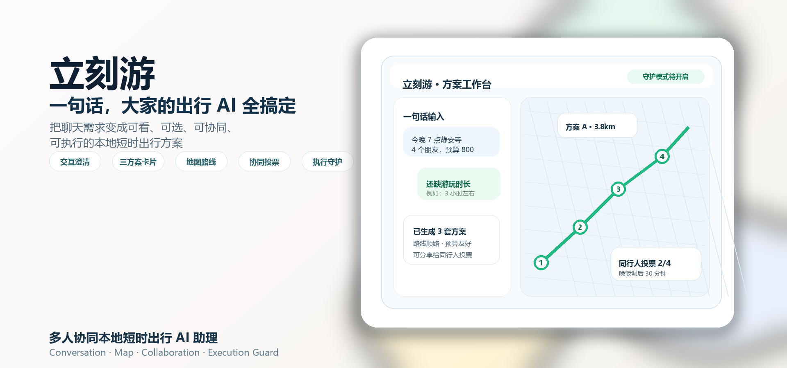
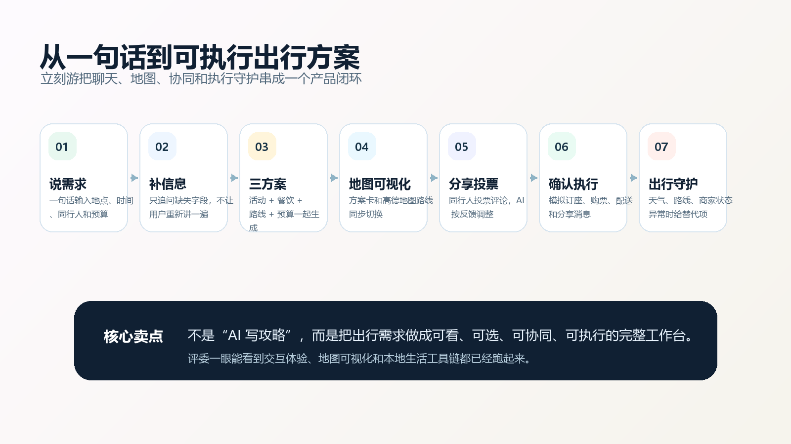
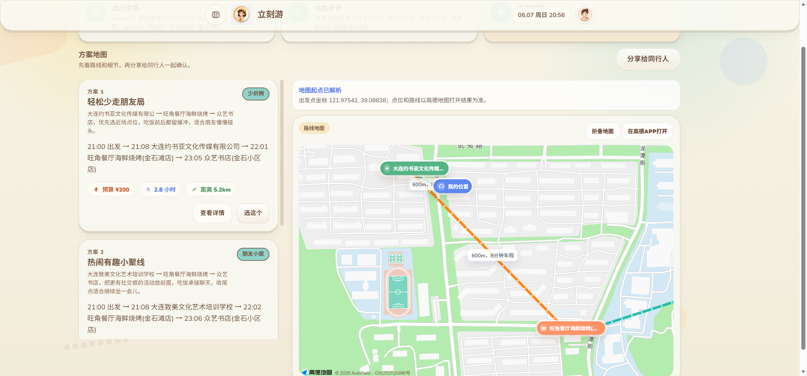
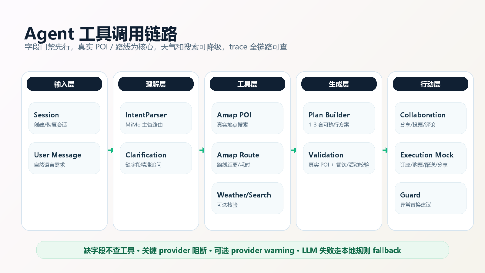

  

  
  
  

  
  
  
  
  
  

<b>立刻游</b> 是一个把多人出行需求变成可视化、可协同、可执行方案的本地生活 AI 助理。 它不只输出攻略文本，而是把聊天澄清、三方案卡片、地图路线、同行投票、模拟执行和出行守护串成一个产品闭环。

## 它和普通 AI 出行助手有什么不一样

普通 AI 出行助手常见路径是：`用户问一句 -> 模型写一段推荐 -> 用户自己查地图/问朋友/订东西`。

立刻游多做三件事，突出的是 **交互体验 + 可视化规划**：

| 差异点 | 解决的问题 | 立刻游的做法 |
| --- | --- | --- |
| **交互澄清** | 用户一句话经常缺时长、地点或预算，普通助手容易直接瞎编 | 先做字段门禁；缺什么只问什么，补充后合并上一轮上下文 |
| **地图可视化** | 纯文本方案难判断路线是否绕、距离是否合理 | 方案卡和地图联动，展示时间线、距离、交通耗时和路线风险 |
| **多人协同** | 家庭/朋友出行不是一个人拍脑袋，意见会分散 | 支持分享、投票、评论，AI 根据反馈调整方案并推进确认 |

一句话：**立刻游把“AI 写攻略”升级成一个能看、能选、能一起商量、能继续执行的出行工作台。**

---

## 产品闭环

  

从一句话需求开始，系统会先判断是否缺少地点、时间、时长、同行人、预算等关键字段。信息完整后，再调用真实 POI、路线、天气和可选搜索工具，生成 1-3 套可展示方案。用户选中方案后，可以分享给同行人投票评论，并进入模拟订座、购票、配送、分享消息和出行守护流程。

---

## 真实界面截图

| 聊天澄清 | 方案地图 | 协同与执行 |
| --- | --- | --- |
| 展示一句话输入、缺字段澄清和补充答案 | 展示三方案卡片、高德地图路线和方案切换 | 展示投票评论、确认执行和守护状态 |

<!--

<table>
<tr>
<td width="33%" valign="top">

<h3 align="center">① 聊天澄清</h3>

一句话输入后，系统只追问缺失字段，避免用户重复描述需求。

</td>
<td width="33%" valign="top">

<h3 align="center">② 方案地图</h3>

三套方案卡片和地图路线联动，预算、时长、距离和风险一屏可看。

</td>
<td width="33%" valign="top">

<h3 align="center">③ 协同与执行</h3>

同行人投票评论后进入模拟执行和出行守护，不停在推荐文本。

</td>
</tr>
</table>
-->

---

## Agent 工具链

  

后端由 `PlanningService` 驱动稳定状态机：创建会话、解析意图、合并澄清答案、检查必填字段、调用外部 provider、生成方案、校验方案、确认执行。关键原则是：**缺字段不查工具，关键 provider 阻断，可选 provider warning，LLM 失败走本地规则 fallback**。

核心工具链：

- `IntentParserAgent`: MiMo 主备路由 + 本地规则 fallback。
- `ClarificationService`: 判断地点、时间、时长、同行人、预算和核心需求是否完整。
- `AmapPoiSearchTool` / `AmapRouteEstimateTool`: 查询真实 POI 和路线距离/耗时。
- `AmapWeatherTool` / `SearchVerifierAgent`: 天气和网页核验，可降级为 warning。
- `PlanValidationService`: 校验真实 POI、时间线、餐饮和活动覆盖。
- `CollaborationMockService` / `MockTools` / `GuardService`: 分享协同、模拟执行、出行守护。

---

## 技术栈

| 层 | 技术 |
| --- | --- |
| 前端 | Vue 3, Vite, `@amap/amap-jsapi-loader` |
| 后端 | Java 17, Spring Boot 3.3, Spring Web, WebSocket, JPA |
| 数据库 | MySQL, Redis session |
| LLM | MiMo-compatible LLM, Amap Web Service, Amap JS API, optional Tavily |

## 产品文档

请阅读 [docs/product-design.md](docs/product-design.md) 

