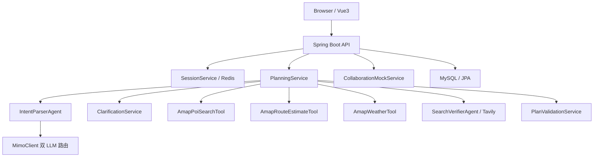
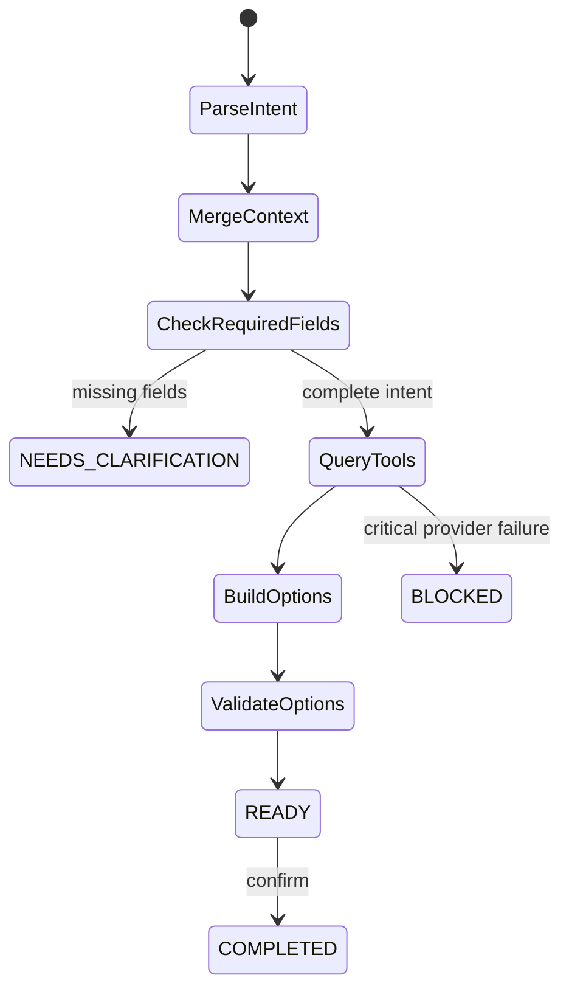

# 技术架构

## 总览



## 前端结构

```text
frontend/
  src/
    App.vue                 主界面、流程状态、方案展示、协同/执行/我的页
    api.js                  API 封装和 session token 恢复
    main.js                 Vue 入口
    components/
      TripMap.vue           高德地图模块
```

### 前端核心状态

- `activeView`: 当前页面，包含 `chat`、`collab`、`execute`、`profile`。
- `currentStep`: 聊天流程步骤，包含 `need`、`clarify`、`plans`。
- `messages`: 聊天消息和澄清卡片。
- `shownPlans`: 当前已生成方案，保留后可在步骤栏切回方案地图。
- `activeMapRank`: 当前地图展示的方案 rank。
- `clarificationAnswers`: 当前澄清表单填写内容。
- `completedClarificationAnswers`: 生成方案后的补齐摘要快照。

### 地图模块

`TripMap.vue` 使用 `@amap/amap-jsapi-loader` 懒加载高德 JS API。地图只在方案页出现后初始化；切换方案时复用 marker、polyline 和 text overlay，并通过防抖避免快速点击造成卡顿。

## 后端结构

```text
backend/src/main/java/com/localagent/
  controller/
    ApiController.java
  dto/
    ApiDtos.java
  model/
    PlanSession.java
    PlanOption.java
    Poi.java
    ToolCallLog.java
  repo/
    *Repository.java
  service/
    PlanningService.java
    ClarificationService.java
    IntentParserAgent.java
    MimoClient.java
    AmapPoiSearchTool.java
    AmapRouteEstimateTool.java
    AmapWeatherTool.java
    SearchVerifierAgent.java
    PlanValidationService.java
    CollaborationMockService.java
```

## 后端状态机

`POST /api/plans` 由 `PlanningService` 驱动，核心状态如下：



关键规则：

- `previousPlanId` 是上下文合并契约，补充答案必须合并上一轮 intent。
- 信息未完整时不调用高德、路线、天气和搜索。
- 天气和搜索是可选工具，失败进入 warnings，不阻断核心规划。
- 高德 POI 和路线是关键工具，正常运行失败时返回可理解阻断。

## 双 LLM 路由

`MimoClient` 管理 primary 和 secondary 两条 MiMo-compatible 通道：

- 默认模式：`primary-fallback`。
- primary 超时、限流、5xx、空响应或 JSON 异常时，只切一次 secondary。
- 两路都失败时，`IntentParserAgent` 使用本地规则 fallback，不能让接口 500。
- 每次调用 trace 包含 lane、model、durationMs、fallbackReason。

## 外部工具

- 高德 Web Service：
  - POI 搜索：`AmapPoiSearchTool`
  - 地理编码：POI 工具内部按需调用
  - 路线估算：`AmapRouteEstimateTool`
  - 天气：`AmapWeatherTool`
- 高德 JS API：
  - 前端地图展示、标注、路线可视化、打开高德 App/H5。
- Tavily：
  - 可选网页核验，失败不阻断。

## 数据持久化

- MySQL：
  - `PlanSession`: 一次规划会话状态、intent、result、execution。
  - `PlanOption`: READY 方案快照。
  - `FeedbackEvent`: 用户反馈事件。
  - `ToolCallLog`: 工具调用 trace。
- Redis：
  - session token 存储。正常运行必须启用 Redis；测试可以 mock。

## 测试设计

- `ApiControllerTest`: HTTP 层、澄清、上下文合并、方案返回、协同/记忆/守护。
- `ApiControllerBlockingTest`: 外部关键 provider 缺失或失败时阻断。
- `PlanningServiceTest`: 规划服务核心行为和异常恢复。
- `MimoClientTest`: 双 LLM fallback 行为。

## 性能注意点

- LLM 超时配置保持短超时，避免长尾拖慢。
- POI 查询内部并行，但关键词数量有限制。
- 路线候选数量有限制，单个候选路线失败会跳过，不阻断全部方案。
- 前端地图懒加载，切换方案复用 overlay。
