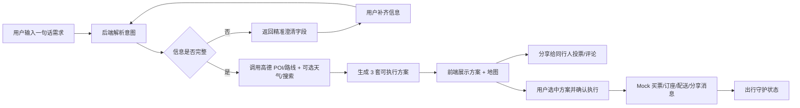

# 产品介绍

## 产品定位

立刻游是面向周末家庭出游、朋友小聚、情侣约会和本地 Citywalk 的多人协同本地短时出行 AI 助理。

一句话定位：

> 一句话，所有人的出行需求，AI 全帮你搞定，不用你操心。

它不是内容推荐流，也不是纯地图工具。它的核心任务是把用户和同行人的自然语言需求转成可执行的本地出行方案，并在确认后提供协同、执行和守护能力。

## 要解决的问题

- 商量乱：微信群里讨论分散，需求和反对意见容易丢。
- 做攻略烦：用户要查地点、餐厅、路线、天气、营业状态和预算。
- 订东西麻烦：买票、订座、安排配送通常要切多个 App。
- 突发情况慌：天气、满位、路况变化时需要临时改计划。

## 目标用户

- 周末带孩子出门的家庭用户。
- 约朋友临时吃喝玩乐的小团队。
- 想要低成本本地约会的情侣。
- 想在附近逛吃、看展、散步的城市用户。

## 核心流程

## 当前界面

- 默认页：聊天式入口，用户输入自然语言需求。
- 澄清页：Web 端双列表单 + 智能预设卡片，补齐地点、时长、同行人、预算等。
- 方案页：左侧 3 套方案卡片，右侧高德地图；点击方案时地图同步切换。
- 协同页：展示方案、投票、评论。
- 执行页：展示 AI 帮忙完成的 mock 进度。
- 我的页：展示全员记忆标签。

## 方案质量标准

READY 方案必须满足：

- 至少 3 个 POI。
- 至少 1 个活动/娱乐/文化 POI。
- 至少 1 个餐饮 POI。
- 有时间线、预算估算、路线距离/耗时。
- POI 来自真实高德数据或测试 profile mock，正常运行不伪造地点。
- 外部工具调用有 trace，便于排查。

## 官方验收约束

见仓库根目录 [官方约束条件.md](../官方约束条件.md)。当前项目落地时重点遵守：

- 方案生成不超过 30 秒。
- 单工具响应目标不超过 3 秒。
- 路线生成小于 10 秒。
- 端到端不超过 2 分钟。
- 异常覆盖无座、无票、时间/路线冲突。

## 与竞品的差异

- 相比地图/本地生活推荐页：立刻游以对话完成任务，不要求用户自己筛列表。
- 相比旅行规划工具：立刻游聚焦本地短时出行，不做长途旅行管理。
- 相比普通 AI 旅行助手：立刻游必须调用真实 POI/路线并保留工具 trace，不能只输出文本建议。
- 相比单人规划：立刻游保留多人协同、投票、评论和记忆方向。
